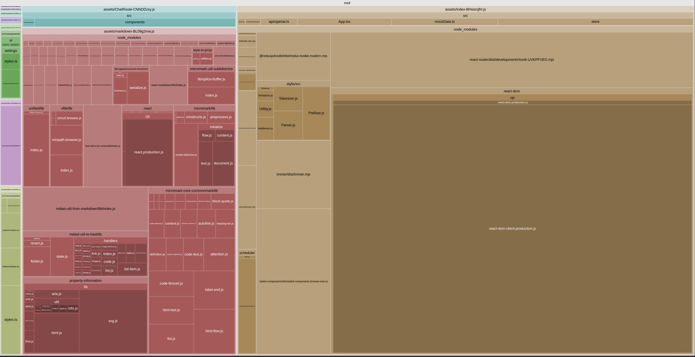

# Mock Chat UI (React)

Static UI shell for a future chat application (homework project). Built with React + TypeScript + Vite.

Includes:
- Responsive layout with sidebar + chat window
- Auth screen (mocked), settings drawer, empty/error UI states
- Message rendering with basic Markdown via `react-markdown`
- Light/dark theme via CSS variables
- Styling via `styled-components`

## Dev

```bash
npm install
npm run dev
```

## Tests

Run tests with Vitest:

```bash
npm test
```

Run tests once (CI mode):

```bash
npm test -- --run
```

## Bundle Audit

Bundle visualization from `vite-bundle-visualizer`:



## Deploy

The app is configured for Vercel with a server-side proxy function at `api/chat.ts`.

Required environment variable:

```bash
OPENAI_API_KEY=your_server_side_key
```

Important:
- do not expose the OpenAI key via `VITE_*` variables
- the browser calls `/api/chat`, and only the Vercel function talks to OpenAI

## Deploy to Vercel

1. Install the Vercel CLI if needed:

```bash
npm i -g vercel
```

2. Log in and link the project:

```bash
vercel
```

3. Add the server-side OpenAI key in Vercel:

```bash
vercel env add OPENAI_API_KEY
```

4. Deploy to production:

```bash
vercel --prod
```

Notes:
- `vercel.json` already contains SPA routing fallback for React Router
- local example env is documented in `.env.example`
- after deployment, open `/chat/<id>` directly to confirm router rewrites work
- also test the deployed app in an incognito window to verify clean first-run behavior

### Test Coverage

**InputArea** (`src/components/chat/InputArea/`)
- Sending messages on button click and Enter key
- Preventing send on Shift+Enter (newline)
- Disabling submit for empty/whitespace input
- Clearing input after successful send
- Showing stop button and preventing send while loading

**Message** (`src/components/chat/Message/`)
- Copying assistant message content to clipboard
- Showing "Copied" state after successful copy
- Auto-resetting copied state after 2 seconds
- Showing typing indicator for pending assistant messages
- Hiding copy button for user messages and pending states

**Sidebar** (`src/components/sidebar/Sidebar/`)
- Search functionality - calling onSearchChange when typing
- Delete confirmation dialog appearing on delete button click
- Canceling delete dialog without deleting
- Confirming delete and calling onDeleteChat with correct ID

**chatSlice reducer** (`src/store/chatSlice.test.ts`)
- Creating new chats with auto-generated titles
- Deleting chats and switching to next available chat
- Resetting state when last chat is removed
- Editing chat titles
- Sending messages (adding user/assistant messages, generating titles for empty chats)
- Successful message completion updates
- Handling failed messages (removing placeholder, storing error)

**Persistence** (`src/store/persistence.test.ts`)
- Saving chat state to localStorage
- Loading chat state from localStorage
- Handling invalid JSON gracefully
- Handling missing localStorage data
